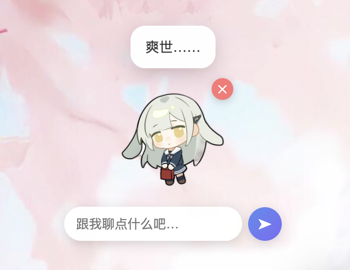

<div align="center">

# 🐾 mini-agent · 会调用工具的 AI Agent + 桌面宠物

**一个 LangChain AI Agent 内核，外加一只活在你桌面上、能聊天、能换皮、可自定义人设的 LLM 桌宠。**

<p>
  
  
  
  
  
</p>

</div>

---

## 📖 这是什么

项目分两层，可以单独用，也可以合起来用：

| 层 | 是什么 | 关键词 |
|----|--------|--------|
| 🧠 **Agent 内核** | 基于 LangChain 的命令行 AI Agent，能自主拆解任务、调用工具、多步执行 | Agent · Tool-calling · Prompt |
| 🐱 **桌面宠物** | 把 Agent 包成 HTTP 服务，套上一只透明可拖拽、能聊天、能换皮换人设的桌宠 | Electron · FastAPI · 产品化 |

> 给 Agent 一句话：*「查一下最近 AI Agent 领域的 3 个热点，中文总结后保存成 report.md」*
> 它会自动完成：**联网搜索 → 读网页 → 总结 → 写文件**，全程无需人工干预。

---

## 🎬 预览

<div align="center">
  
  <br>
  <sub>自定义皮肤：上传立绘 → AI 抠图去背景 → 透明融入桌面，可拖拽 / 聊天 / 换人设</sub>
</div>

---

## ✨ 功能亮点

### 🧠 Agent 内核
- **自主多步推理**：LangChain `create_agent`（底层 LangGraph），LLM 自己决定调哪个工具、何时收尾，即 ReAct 循环
- **5 个内置工具**：联网搜索、读网页、安全计算器、写文件、读文件
- **模型可插拔**：兼容 DeepSeek / 通义千问 / 智谱 GLM / OpenAI，改一行配置即可切换
- **多轮对话记忆**：支持上下文连续追问
- **安全设计**：计算器用 AST 白名单（拒绝 `eval`），文件操作锁死在 `workspace/` 目录内

### 🐱 桌面宠物
- **透明无边框 + 全屏自由拖拽**：宠物浮在桌面任意位置，鼠标穿透不挡操作
- **就地聊天**：悬停弹出输入框，或双击打开对话记录面板（`localStorage` 持久化）
- **🎨 换肤即换人设**：每张皮肤 = 外观 + 人设 + 固定反应，切皮肤就切 LLM 的说话风格
- **➕ 自己造皮肤**：应用内表单填名字 / 人设 / 反应，**上传头像自动 AI 抠图去背景**
- **📤 卡片分享**：皮肤可导出 / 导入为 JSON，形成"人设卡"社区雏形
- **⌨️ 全局快捷键** `⌘/Ctrl+Shift+P`：一键把跑远的宠物召回屏幕

---

## 🏗️ 架构

```
┌────────────────────────┐      HTTP/JSON      ┌──────────────────────────────┐
│   Electron 桌宠前端      │ ──────────────────► │   FastAPI 服务 (server.py)     │
│  renderer.js / index    │                     │                              │
│  · 拖拽 / 聊天 / 换肤     │   POST /chat        │  · /chat   按皮肤注入 persona  │
│  · 上传头像 → 抠图       │   POST /remove-bg   │  · /remove-bg  rembg AI 抠图   │
│  · 人设卡 导入/导出       │ ◄────────────────── │  · /reset  清空会话记忆        │
└────────────────────────┘   透明 PNG / 回答     └──────────────┬───────────────┘
                                                                │
                                                                ▼
                                              ┌──────────────────────────────┐
                                              │  LangChain Agent (create_agent)│
                                              │  LLM ⇄ web_search/read_webpage │
                                              │       calculator/save/read     │
                                              │  ← ReAct 循环直到任务完成        │
                                              └──────────────────────────────┘
```

---

## 📂 代码结构

```
mini-agent/
├── main.py                 # CLI 入口
├── server.py               # FastAPI：/chat /remove-bg /reset
├── requirements.txt
├── src/
│   ├── config.py           # 读 .env，构建供应商无关的 LLM 客户端
│   ├── tools.py            # 5 个工具，docstring 即工具说明（喂给 LLM）
│   ├── agent.py            # 组装 LLM + 工具 + 提示词；支持运行时注入人设
│   └── cli.py              # 命令行交互、多轮记忆、富文本输出
└── desktop-pet/            # Electron 桌宠
    ├── main.js             # 主进程：透明窗口 / 全局快捷键 / 鼠标穿透
    ├── preload.js          # 安全桥接 IPC
    ├── renderer.js         # 拖拽 / 聊天 / 换肤 / 抠图 / 人设卡导入导出
    ├── index.html          # UI
    ├── skins.js            # 皮肤定义（外观 + 人设 + 反应）
    └── start.sh            # 一键起后端 + 桌宠
```

---

## 🚀 快速开始

### 1. Agent 内核（命令行）

```bash
python3 -m venv .venv
source .venv/bin/activate
pip install -r requirements.txt

cp .env.example .env          # 然后编辑 .env，填入你的 LLM_API_KEY
python main.py
```

试一试这些指令：

- `北京到上海的高铁大概多少公里，按时速 350 算要开多久？` （搜索 + 计算器）
- `搜一下 LangChain 是什么，用三句话解释，存成 langchain.md` （搜索 + 写文件）

### 2. 桌面宠物

```bash
# 装好 Python 依赖后，再装前端依赖
cd desktop-pet && npm install && cd ..

# 一键启动（自动起 FastAPI 后端 + Electron 桌宠）
bash desktop-pet/start.sh
```

macOS 用户也可直接双击根目录的 `启动桌面宠物.command`。

### 3. 部署到服务器（让别人也能用）

只需把**后端**部署到服务器（桌宠仍装在各用户电脑上），2G 内存即可。
小白向手把手教程见 **[`deploy/README.md`](deploy/README.md)**，含一键脚本 `deploy/setup.sh`、systemd 自启、swap、防火墙全流程。

---

## 🎨 人设卡系统怎么玩

一张"皮肤 / 人设卡"本质就是一个 JSON：

```json
{
  "name": "傲娇猫娘",
  "appearanceType": "image",
  "image": "data:image/png;base64,....",
  "persona": "你是一只傲娇的猫娘，嘴上嫌弃但内心关心主人，句尾偶尔加'哼！'",
  "reactions": {
    "greeting": "哼，你终于来了。",
    "click": ["干嘛啦！", "别戳我！", "...哼"]
  }
}
```

- **创建**：右键宠物 → `➕ 创建皮肤` → 填表单、传头像（自动抠图）→ 保存即用
- **切换**：右键 → `🎨 换皮肤`，`persona` 会作为 system prompt 实时注入 LLM
- **分享**：表单里 `📤 导出卡` 生成 `.json`，别人 `📥 导入卡` 即可拥有同款人设

### 🖼️ 上传头像自动去背景

上传的位图自带背景，直接贴上去会有突兀的白方块。本项目的处理：

1. 前端把图发到后端 `POST /remove-bg`
2. 后端用 **rembg（u2net 模型）** AI 抠图，返回透明 PNG
3. 后端不可用时，前端自动降级为**画布角落漫水去背**（对纯色 / 白底有效）

> 首次抠图会下载 u2net 模型（约 175MB）到 `~/.u2net/`，之后纯本地、秒级、离线可用。

---

## 🔄 切换模型

只需改 `.env` 三个变量（示例见 `.env.example`）：

```ini
LLM_API_KEY=你的key
LLM_BASE_URL=https://api.deepseek.com   # 换成对应供应商地址
LLM_MODEL=deepseek-chat                 # 换成对应模型名
```

---

## 📦 技术栈

**后端 / AI**：Python · LangChain 1.x · FastAPI · OpenAI 兼容接口 · rembg(u2net) · BeautifulSoup
**前端 / 桌面**：Electron · 原生 HTML/CSS/JS · Canvas · localStorage

---

## 🗺️ Roadmap

- [x] Agent 内核：工具调用 + 多轮记忆
- [x] 桌宠：透明拖拽 / 聊天 / 换肤
- [x] 自定义人设卡 + 上传头像 AI 抠图
- [x] 人设卡 JSON 导入 / 导出
- [ ] 「上传图 → AI 自动写人设」（让 Agent 帮你生成 persona）
- [ ] 在线皮肤社区（上传 / 浏览 / 一键安装）
- [ ] 工具调用结果缓存 · Docker 一键部署

---

<div align="center">
<sub>用 LangChain 搭内核，用 Electron 给它一个家。</sub>
</div>
